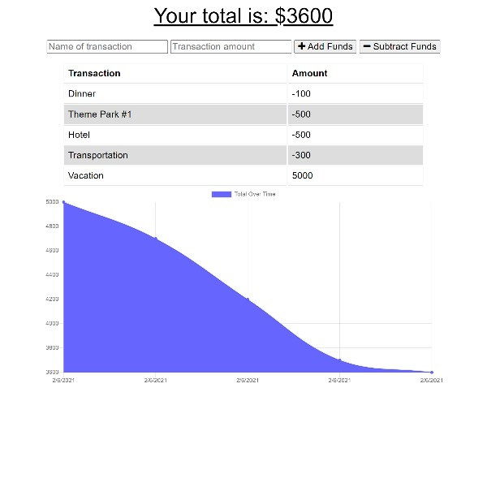

# [GitHub](https://github.com/MichelleMcConville/18-budget-tracker) 🔗 ***`OR`*** [Live Demo](https://mchel-budget-tracker.herokuapp.com/)🔗


## Description

An app to track income and expenses. Works both online & offline & is downloadable as a PWA!

| ***Screenshot***                   |
| :--------------------------------: |
|  |

## Table of Contents ✨

* [Installation](#installation)
* [Usage](#usage)
* [Contributing](#contributing)
* [Tests](#tests)
* [Questions](#questions)
* [License](#license)

## Installation 🛠️ <a name="installation"></a>

```node
Type the following command inside the Integrated Terminal:
  1. npm install
```

## Usage ⚙️ <a name="usage"></a>

```.
Select the link below & enjoy!
```

> [Click to go to App](https://mchel-budget-tracker.herokuapp.com/) 🔗

```.
OR to Run Locally
```

### `npm start`

## Contributing 🤝 <a name="contributing"></a>

All contributions must be approved by owner

## Tests ✅ <a name="tests"></a>

There are currently no testing procedures for this application

## Questions ❓ <a name="questions"></a>

* 📧 If you have any questions please [**eMail**](mailto:dev.mchel@gmail.com) me
* :octocat: Check out more of my work on [**GitHub**](https://github.com/MichelleMcConville)

## License 📝 <a name="license"></a>

This project is **`General Public License v2.0`** licensed

---

 Copyright ©️ 2021 🌷 Michelle McConville
